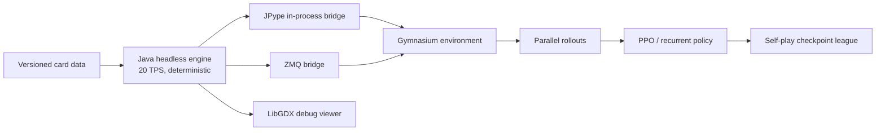

# NextoCR

[](https://github.com/theohugo/NextoCR/actions/workflows/build-and-test.yml)
[](LICENSE)
[](https://adoptium.net/)
[](https://gymnasium.farama.org/)

NextoCR is an open research project for training self-play agents in a fast, offline,
Clash Royale-like battle simulator. The long-term target is the pattern that made
[Nexto](https://github.com/Rolv-Arild/Necto) useful for Rocket League research:

```text
headless simulator -> Gymnasium -> parallel rollouts -> self-play league -> evaluated checkpoints
```

The project starts from the mature simulation work in
[voonhous/crforge](https://github.com/voonhous/crforge) instead of rebuilding the game engine from
zero. The inherited engine is deterministic, data-driven, extensively tested, and already exposes
both ZMQ and in-process JPype bridges to Python.

> **Derivative-work notice:** NextoCR is a modified fork of `crforge`, copyright 2025-2026
> voonhous, used under Apache-2.0. Existing Java packages and the compatibility Python package keep
> the `org.crforge` / `crforge_gym` names for now. See [NOTICE](NOTICE) for attribution.

> [!WARNING]
> NextoCR is an early research environment, not a frame-perfect reproduction of the live game.
> It is offline-only: this repository does not connect to, automate, modify, or interfere with the
> official game client or service.

## What already works

- Deterministic, seedable simulation running at 20 logic ticks per simulated second.
- Headless combat, targeting, movement, elixir, decks, hands, towers, overtime, and win conditions.
- Melee, ranged, AOE, chain, scatter, charge, dash, hook, reflect, shields, spawns, transformations,
  and status effects.
- Data-driven catalog with 240 definitions: 130 base definitions, 21 evolutions, and 89 generated
  alternate/hero forms. The implementation tracker currently marks 112 entries `DONE`, 6
  `PARTIAL`, and 10 `MISSING` across 128 tracked competitive/special/tower entries.
- Java test suite covering the core engine, card loading, combat mechanics, and Gym bridge.
- Gymnasium environment with compact binary observations and action masking.
- ZMQ process bridge and a faster in-process JPype backend.
- Parallel single-JVM rollouts through `ThreadedJPypeVecEnv`.
- Reproducible MaskablePPO training, durable checkpoints, bounded self-play league, fixed
  rule-based evaluation, and exact pause/resume semantics.
- Local web manager for runs, versions, metrics, logs, checkpoints, and abstract match replays.
- Optional LibGDX debug visualizer; the headless engine has no GUI dependency.

The exact coverage and known gaps are tracked in [docs/card_tracker.md](docs/card_tracker.md). Run
`python scripts/card_catalog_report.py` to audit the machine-readable catalog locally.

## Architecture



| Module | Role |
| --- | --- |
| `core/` | Headless entities, systems, physics, combat, match state |
| `data/` | JSON card/unit/projectile/buff definitions and typed loaders |
| `gym-bridge/` | Java sessions, observations, rewards, ZMQ protocol |
| `python/` | Gymnasium API, JPype bridge, vector environments, training examples |
| `desktop/` | Debug visualization only; never required for training |

See [docs/architecture.md](docs/architecture.md) for the detailed execution graph and module map.

## Quick start

Requirements:

- Java 17
- Python 3.10 or newer for RL tooling

### Recommended on Windows: one-file launcher

Double-click [`NextoCR.bat`](NextoCR.bat). On its first launch it creates `.venv` and installs the
training dependencies; later launches open the existing manager directly at
`http://127.0.0.1:8765/`.

From the local dashboard you can:

- start the 10-million-step Mortar mirror self-play run;
- follow steps, throughput, ETA, outcomes, evaluation, league state, and logs;
- create a checkpoint while training continues;
- use **Pause + checkpoint** before shutting down the PC, then **Resume** the next day;
- create a new version from an immutable checkpoint without overwriting its parent run;
- generate and watch a deterministic abstract match played by the selected checkpoint.

Closing the browser tab does not stop training. Use **Pause + checkpoint** and wait for the
confirmation before turning off the computer. The manager binds only to `127.0.0.1` and never
controls the official game client. See [docs/manager.md](docs/manager.md) for the lifecycle and
recovery details.

### 1. Verify the simulator

macOS/Linux:

```bash
./gradlew clean build
python3 scripts/card_catalog_report.py --strict
```

Windows PowerShell:

```powershell
.\gradlew.bat clean build
python scripts/card_catalog_report.py --strict
```

### 2. Install the Python environment

```bash
python -m venv .venv
```

macOS/Linux:

```bash
source .venv/bin/activate
python -m pip install -e "python[jpype,train]"
```

Windows PowerShell:

```powershell
.\.venv\Scripts\Activate.ps1
python -m pip install -e "python[jpype,train]"
```

### 3. Step an environment in-process

Prime the bridge distribution (the Python helper also refreshes this task incrementally before it
starts a JVM):

macOS/Linux:

```bash
./gradlew :gym-bridge:installDist
```

Windows PowerShell:

```powershell
.\gradlew.bat :gym-bridge:installDist
```

Then:

```python
from nextocr_gym import NextoCREnv

env = NextoCREnv(backend="jpype", opponent="rule_based")
observation, info = env.reset(seed=42)

terminated = truncated = False
while not (terminated or truncated):
    action = env.action_space.sample()
    observation, reward, terminated, truncated, info = env.step(action)

env.close()
```

The legacy import remains available for upstream compatibility:

```python
from crforge_gym import CRForgeEnv
```

### 4. Benchmark or train

```bash
python python/examples/bench_step.py --jpype-only --steps 5000
python python/examples/train_ppo.py --jpype --num-envs 8 --timesteps 100000
# With a ZMQ bridge already running; JSON is required to expose the red hand correctly:
python python/examples/train_ppo.py --opponent self_play --num-envs 1 --timesteps 100000
```

These examples are baselines, not yet the final Nexto-style league trainer. The full league,
historical-opponent sampling, Elo evaluation, and reproducible experiment registry are explicit
roadmap work. The first local throughput smoke measurement is recorded in
[docs/benchmarks.md](docs/benchmarks.md), including the machine, commands, and methodological limits.

## Roadmap

The immediate milestone is simulator fidelity, not a bigger neural network:

1. Freeze a deterministic and benchmarked baseline.
2. Make card coverage and data provenance machine-verifiable.
3. Complete Tower Troops, champion abilities, evolutions, and current balance data.
4. Scale in-process vector rollouts and publish reproducible throughput/fidelity benchmarks.
5. Build population self-play with historical checkpoints and held-out evaluation bots.
6. Only then iterate on PPO/recurrent/attention policies and reward design.

See [ROADMAP.md](ROADMAP.md) for acceptance criteria and [docs/research.md](docs/research.md) for the
project comparison that led to this foundation.

## Card data and fidelity

Combat values in the inherited catalog are community-decoded facts from publicly observable game
behavior and data. They should be treated as versioned research inputs, not as an official API.
NextoCR deliberately separates:

- official API metadata (identity, rarity, cost, and level metadata),
- simulator mechanics and normalized numeric parameters,
- measured interaction tests used to validate fidelity.

No official art, audio, client binaries, credentials, or private server code should be added. Read
[docs/data-provenance.md](docs/data-provenance.md) before updating the catalog.

With an official developer API token and an allow-listed IP, set
`CLASH_ROYALE_API_TOKEN` through your local secret mechanism, then refresh the identity catalog:

```bash
mkdir -p .local
python scripts/sync_official_catalog.py \
  --output .local/official-catalog.json
```

Windows PowerShell:

```powershell
New-Item -ItemType Directory -Force .local
python scripts/sync_official_catalog.py --output .local/official-catalog.json
```

The normalizer keeps cards and Tower Troops separate, excludes asset URLs, and never logs the
token. `.local/` is ignored by Git; the generated file is an audit input, not certified combat
statistics.

## Responsible research scope

This repository is for offline simulation, AI research, and education. It must not be used to
automate the live game, evade anti-cheat systems, operate accounts, or interfere with Supercell
services. Any future sim-to-real work requires a separate policy and legal review and is outside the
current repository scope.

This material is unofficial and is not endorsed by Supercell. For more information, see
[Supercell's Fan Content Policy](https://supercell.com/en/fan-content-policy/).

## Contributing

Start with [CONTRIBUTING.md](CONTRIBUTING.md). A useful contribution includes a source or measurement
note, a focused mechanic change, and an interaction test that fails before the fix and passes after
it. Avoid large card-data dumps without provenance.

## Acknowledgements

- [voonhous/crforge](https://github.com/voonhous/crforge): the Apache-2.0 engine and bridge on which
  NextoCR is built.
- [KataCR](https://github.com/wty-yy/KataCR): open visual-perception and offline-RL research for the
  real game interface.
- [MSU-AI/clash-royale-gym](https://github.com/MSU-AI/clash-royale-gym): an early Gymnasium framing.
- [Jason-XII/clash-royale-simulator](https://github.com/Jason-XII/clash-royale-simulator): a recent
  playable simulator and useful comparison; its repository currently has no declared license, so no
  code was copied into NextoCR.

## License

Apache-2.0. See [LICENSE](LICENSE) and [NOTICE](NOTICE).
